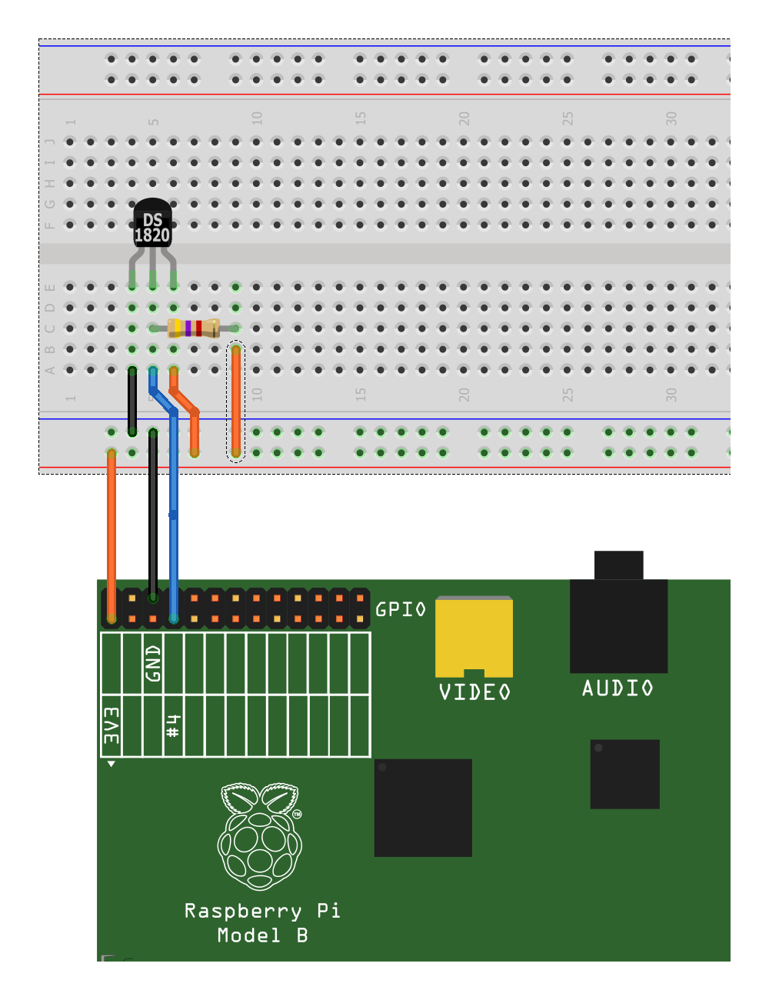

# Temperature sensor

These is a implementation of a one wire temperature sensor.
Temperature is provided to arrowhead.
The arrowhead part uses thees
[library](https://github.com/grammers/client-cpp) to operate.
It also need a connection to an [Arrowhead core](https://github.com/arrowhead-f/core-java).
It is tricky to run that on a pi.
The pis memory is not enough for the entire core.
You would haw to only run the bare essentials.

The sensor that have been used is a DS18B20 Sensor.
If you use a other sensor will you probably change the hard coded address
in `temperature_sensr_pi.cpp::main`.

## Setup
The hard ware setup:

The `.json` files need to be updated to fit your setup.
Check address's, port's and acces_uri!
Load the system to the arrowhead DB by running `ah_get_db_setup -f config.json` on the machine with arrowhead core.
The command is included in `cilent-cpp`.

For more information on how to use 1-wire with raspberry pi [see this
guide](https://www.waveshare.com/wiki/Raspberry_Pi_Tutorial_Series:_1-Wire_DS18B20_Sensor).
